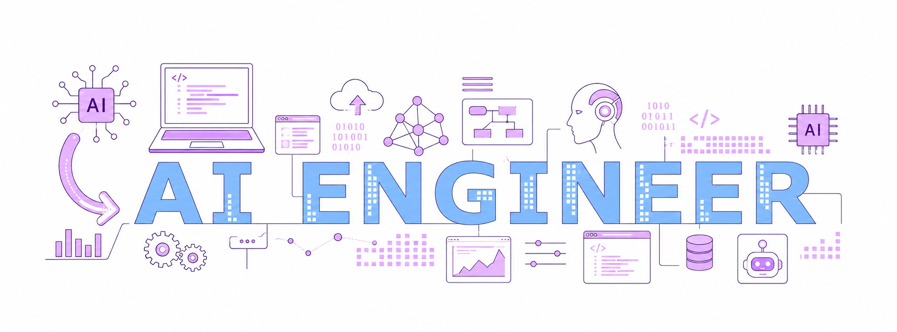

<h1 align="center">Hi 👋, I'm Ritik Tyagi</h1>
<h3 align="center">Machine Learning Engineer • Deep Learning • GenAI</h3>

- 💼 I design and implement end-to-end ML pipelines: data collection, feature engineering, model training, evaluation, deployment, and monitoring.
- 🧠 I work with Python, PyTorch, TensorFlow, scikit-learn, SQL, and cloud-native tooling to deliver reliable models.
- 🚀 I enjoy transforming messy datasets into high-impact ML solutions and iterating toward better performance.
- 📫 Reach me at **ritiktyagiai@gmail.com**

<h3 align="left">Areas of Expertise</h3>
<ul>
  <li>Supervised & unsupervised learning</li>
  <li>Deep learning (computer vision, NLP, tabular models)</li>
  <li>Feature engineering and data preprocessing</li>
  <li>Model validation, hyperparameter tuning, and cross-validation</li>
  <li>Deployment-ready ML systems and reproducible experiments</li>
</ul>

<h3 align="left">Connect with me</h3>

  
  
  
  

<h3 align="left">Tools and Technologies</h3>

  
  
  
  
  
  
  
  

  

